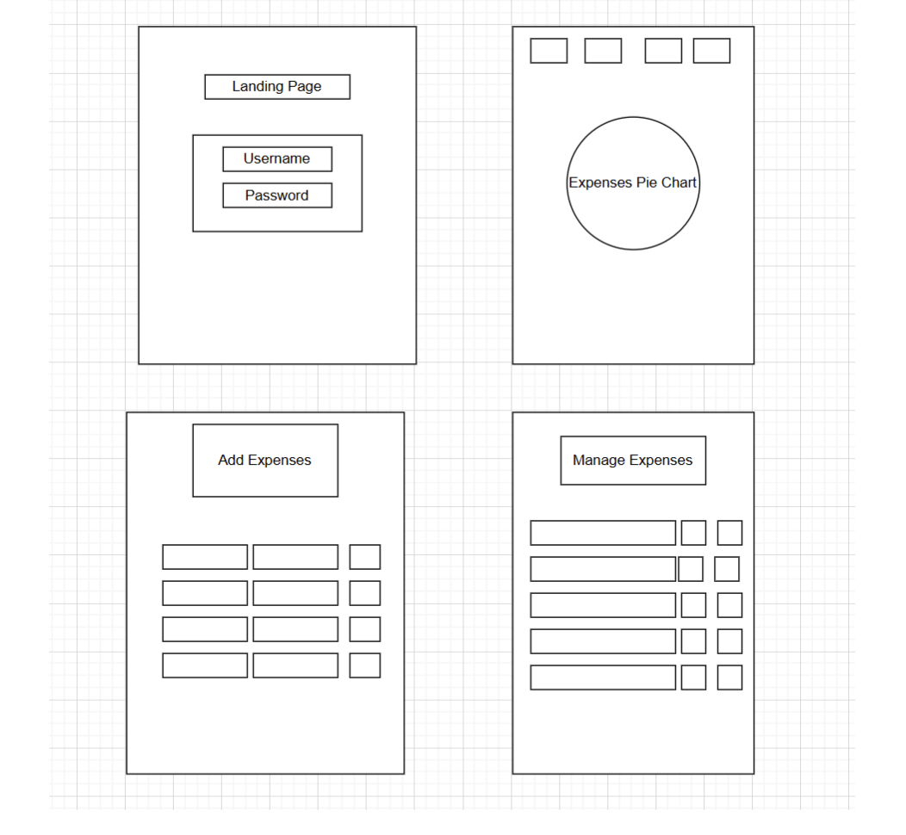

Frontend - https://github.com/joshuaalegbe101/CapstoneFE

# Expense Tracker - Backend

#### A secure and scalable backend for the Expense Tracker application, built using Node.js, Express, and MongoDB.

## Description
The backend provides a **RESTful API** for handling **user authentication, transaction management, and budget tracking**. The system ensures secure data storage with **password hashing and JWT-based authentication**.

## Table of Contents
* [Technologies Used](#technologiesused)
* [Features](#features)
* [Wireframe Images](#wireframes)
* [API Endpoints](#api)
* [Design](#design)
* [Project Next Steps](#nextsteps)
* [About the Author](#author)

## Technologies Used
* Node.js
* Express.js
* MongoDB & Mongoose
* JWT (JSON Web Tokens)
* Bcrypt.js
* Cors & Dotenv

## Features
The backend provides:
- **User authentication (Register & Login)**
- **CRUD operations for transactions**
- **Budget tracking functionality**
- **JWT-based authentication for security**
- **Data validation and error handling**

## Wireframe Images
* Here is an early wireframe layout:

## API Endpoints
| Method | Endpoint               | Description              | Auth Required |
|--------|------------------------|--------------------------|--------------|
| POST   | `/api/auth/register`    | Register a new user      | ❌ No        |
| POST   | `/api/auth/login`       | Login user & get token   | ❌ No        |
| GET    | `/api/transactions`     | Get user transactions    | ✅ Yes       |
| POST   | `/api/transactions`     | Add a new transaction    | ✅ Yes       |
| PUT    | `/api/transactions/:id` | Update a transaction     | ✅ Yes       |
| DELETE | `/api/transactions/:id` | Delete a transaction     | ✅ Yes       |
| GET    | `/api/budgets`          | Get user budgets         | ✅ Yes       |
| POST   | `/api/budgets`          | Add a new budget         | ✅ Yes       |
| DELETE | `/api/budgets/:id`      | Delete a budget          | ✅ Yes       |

## Design
The backend follows **a RESTful API architecture** with **token-based authentication and secured data handling**. The server structure follows **a modular pattern**, keeping **routes, models, and middleware separate** for maintainability.

## Project Next Steps
#### List of Future Enhancements
* Implement **budget notifications** when spending reaches a limit.
* Improve **error handling** with better API responses.
* Integrate **data visualization for financial insights**.

## About the Author
Developed by **Joshua Alegbe**, passionate about building **secure, scalable, and efficient backend systems** for general management applications.

